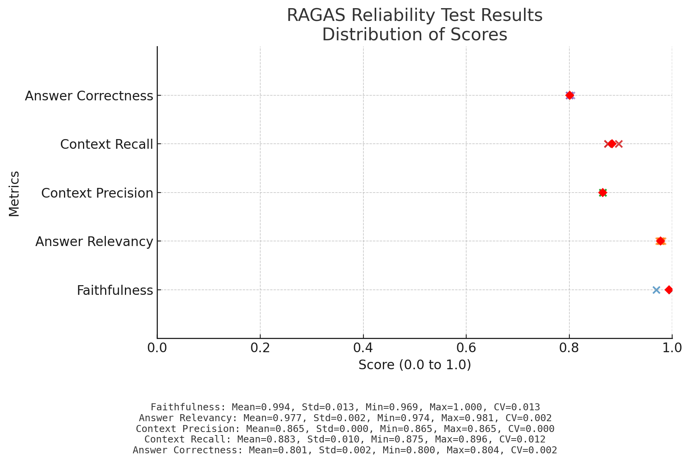

# NASCAR Pit Box AI Assistant

Voice-driven AI assistant for NASCAR pit box operations, featuring LangGraph agents, FastAPI simulator, and comprehensive evaluation.

## Architecture

```
app/
├── graphs/              # LangGraph agent definitions
│   ├── simple_pitbox.py   # Basic Q&A agent
│   └── analytics_agent.py # Advanced analytics with evaluation loop
├── tools/               # Tool implementations
│   ├── simulator_api.py   # FastAPI simulator tools
│   └── rag_knowledge.py   # Knowledge base RAG tools
├── simulator/           # FastAPI NASCAR data simulator
└── knowledge/           # RAG knowledge base
    ├── trackhouse_team.txt    # Trackhouse Racing team info
    ├── nascar_glossary.txt    # NASCAR terminology and rules
    └── nascar_tracks.txt      # Track information and history

mcp_server/              # MCP (Model Context Protocol) server
├── server.py            # Main MCP server with FastMCP
├── requirements.txt     # MCP server dependencies
└── tools/               # Modularized MCP tools
    ├── __init__.py         # Tool exports
    ├── utils.py            # Common utilities and API client
    ├── system_status.py    # System health and vehicle monitoring
    ├── car_data.py         # Car positions, ranks, and lap times
    ├── pit_stop.py         # Pit events, times, and tire data
    ├── race_status.py      # Flags, laps, grid, and track info
    ├── content.py          # Driver and team information
    ├── telemetry.py        # Telemetry channel definitions
    └── analysis.py         # Race leader and strategy analysis

evaluation/              # Evaluation and testing
├── golden_dataset.json   # Q&A pairs for validation
├── eval_harness.py       # Automated evaluation
├── ragas_evaluation.py   # RAGAS reliability testing
└── ragas_distribution.png # RAGAS metrics visualization

tests/                   # Test suite
└── test_rag_knowledge.py  # RAG system tests

web_client/              # Demo interface (TODO: Next.js)
```

## RAGAS Evaluation Results



Reliability testing shows stable performance across all RAGAS metrics with low variance (CV < 0.015). Chart shows individual trial scores (×), mean values (♦), and summary statistics for each metric.
